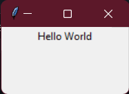
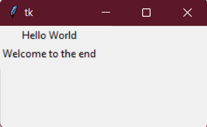
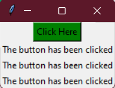
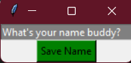
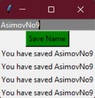

# Working With Tkinter: Self Learning For Some Random Project

Hello, nothing much to see here, just followng some online tutorials, going through documentation and creating sort of like a course outline through working with tkinter. It gets Updated as work gets done. Find the related python scripts in the gui folder.

## Course Outline
1. Labels - hello.py
2. Grids - grid.py
3. Buttons - buttons.py
4. Enteries - entry.py

### Labels
Working with labels. Labels are texts printed into the window, this is the basic start of tkinter, so you basically learn how to make a window through creating a TK() object basically named root, making a label object from the Label() class, and displaying using the method from the root object named mainloop()

### Grids
Working with grids. Grids basically account for the placement of objects in the created window, such as labels and buttons. You'd definitely need to strategically place objects based off what you want your window to display, or allow the user to interface with. The grid in the mage clearly displays the first label in row 0, column 0 and second label in row 1, column 0.

### Buttons
Working with buttons. Making buttons that access a callback function (I love the word callback functions, thinking ROS with subscribers). The window places a green button with black text that repeatedly prints in the window that the button has been clicked

### Enteries
Working with enteries (inputs). Editing the button.py script to add input from the user, so whatever the user types into the entry form is printed in the window.

<table>
<tr>
<th></th>
<th></th>
</tr>
</table>